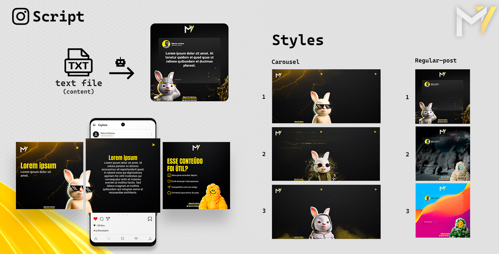

# Instagram Script

This project aims to automate the content production process in instagram. The tool edits the image by applying text and styles to the background of your choice and posts to the logged in Instagram account.

## Dependencies

To run this script you need to install locally on your machine the following dependencies:

- Node.js;
- Imagemagick;
- ZX (https://github.com/google/zx);

## Running

1. Open the root folder and run `npm install`;
4. Run `zx index.mjs` in the root folder to start script;
5. Choice or type of image you want to make, the texts and styles.
6. Done! The files will be in the output folder

## Features

- [x] Editing image files
- [ ] Post to instagram account
